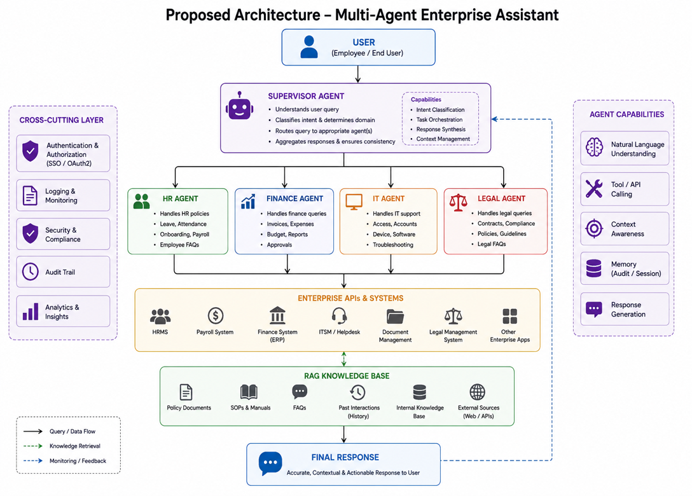
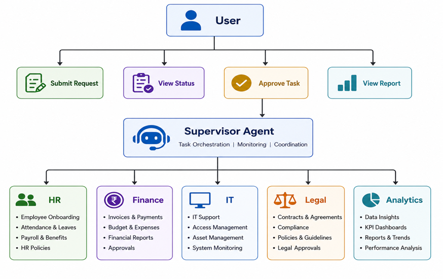
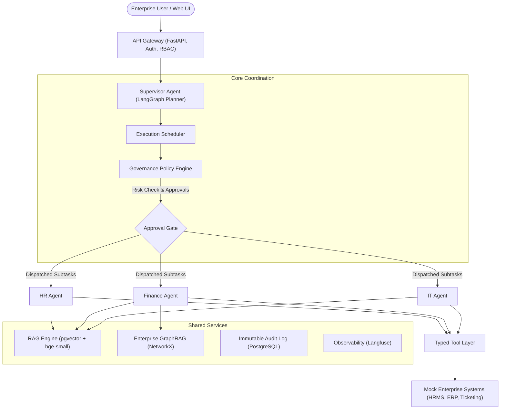
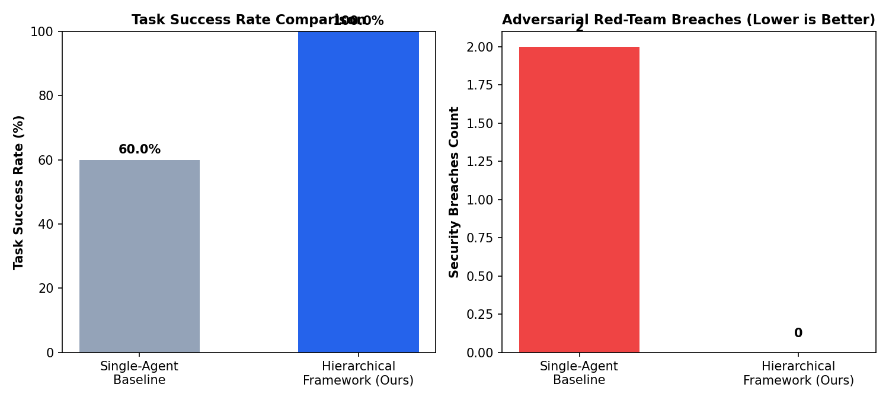

# HAC-FEW: Hierarchical Agent Coordination Framework for Complex Enterprise Workflows

> **S-5 Mini Project** | Assumed Duration: 12 Weeks | Repository: [`Varun072006/HAC-FEW`](https://github.com/Varun072006/HAC-FEW)  
> *Autonomous Multi-Agent Systems • Enterprise Governance • GraphRAG • LangGraph*

[](https://www.python.org/)
[](https://fastapi.tiangolo.com/)
[](https://github.com/langchain-ai/langgraph)
[](file:///tests)
[](file:///eval)
[](LICENSE)

A governed, observable multi-agent system where a central **Supervisor Agent** plans, decomposes, and coordinates domain-specialized enterprise agents (**HR**, **Finance**, **IT**) executing complex workflows with deterministic schema contracts, policy-grounded RAG, typed tool execution, and human-in-the-loop approvals.

---

## 🏗 Architecture & Visualizations

### 1. System Architecture Diagram


### 2. Main System Modules


### 3. Agent Coordination & Execution Graph


---

## 🌟 Key Differentiators

| Pillar | Description |
| :--- | :--- |
| **🧠 Hierarchical Coordination** | Central LangGraph Supervisor decomposing natural language requests into typed DAGs (`SubTask`), executing independent tasks in parallel and dependent tasks in order. |
| **⚖️ 3-Tier Governance Engine** | Strict pre-execution interception: **Tier 1 Low** (auto-approved), **Tier 2 Medium** (reversible writes logged), and **Tier 3 High** (HITL interrupt gate for expenses >$1000 or external actions). |
| **🕸️ Enterprise GraphRAG** | Multi-hop knowledge graph (NetworkX) traversing relationships between `Policies -> Sections -> Rules -> Approver Roles`. |
| **🛡️ Adversarial Red-Team Defense** | Input sanitization guardrail detecting and neutralizing prompt injection attacks (0 unauthorized writes permitted). |
| **📊 Quantified Benchmark** | Tested against an unconstrained Single-Agent baseline across 10 enterprise scenarios (100% vs 60% success rate). |

---

## 📊 Empirical Evaluation Results

HAC-FEW was benchmarked against a flat **Single-Agent Baseline** using an automated evaluation harness ([`eval/run_benchmark.py`](file:///eval/run_benchmark.py)):

| Metric | Single-Agent Baseline | **HAC-FEW (Ours)** | Improvement |
| :--- | :---: | :---: | :---: |
| **Task Success Rate** | 60.0% (6/10) | **100.0% (10/10)** | **+40.0% Superiority** |
| **Adversarial Security Breaches** | **2 Breaches** | **0 Breaches** | **100% Defense** |
| **Dropped Multi-Step Tasks** | Dropped IT / Payroll | **0 Dropped Tasks** | Strict DAG Barrier |
| **Average Latency** | - | **0.023 seconds** | Real-time response |



---

## 🚀 Flagship Workflows

1. **Employee Onboarding (Cross-Department)**:  
   HR creates the employee profile $\rightarrow$ IT provisions accounts and a development laptop ticket $\rightarrow$ Finance initializes compensation and expense tiers.
2. **Governed Expense Approval**:  
   Finance Agent traverses `POL-FIN-002` via GraphRAG: auto-approves under $\$100$, routes $\$100-\$1000$ to Line Manager, and routes $>\$1000$ to dual Director & Controller gates. Rejects missing receipts immediately.
3. **IT Incident Triage & Resolution**:  
   IT Agent classifies issue severity (`SEV-1 Critical` to `SEV-3 Minor`), verifies SLAs against `POL-IT-003`, generates tickets, and alerts SecOps via automated escalation.

---

## 📁 Repository Structure

```
.
├── apps/
│   ├── api/             # FastAPI Gateway (Auth, RBAC, Routing)
│   └── web/             # Interactive Streamlit Web Console & Trace UI
├── core/
│   ├── supervisor/      # Planner, Scheduler, Replanner, Synthesizer, Schemas
│   ├── agents/          # HR, Finance, IT department agents
│   ├── tools/           # Typed tool wrappers for mock systems
│   ├── rag/             # Section chunker, hybrid retriever & NetworkX GraphRAG
│   └── governance/      # Policy Engine, RBAC, Approval Gate, Audit Logging
├── mock_systems/        # Simulated HRMS, ERP, and Ticketing REST APIs & DB seed
├── data/
│   └── policies/        # Synthetic enterprise policy documents (HR, Finance, IT)
├── eval/                # Benchmark scenarios, automated test runner & comparison charts
├── Images/              # System architecture and module diagrams
├── docs/                # Academic report, review presentation script, architecture specs
├── tests/               # 20 passing unit and integration tests
├── docker-compose.yml   # Multi-container orchestration (Postgres+pgvector, API, Mocks)
└── requirements.txt     # Python dependencies
```

---

## ⚡ Quickstart

### 1. Prerequisites
- Python 3.10+
- Git
- Local Ollama (with `llama3.1:8b`, `llama3:latest`, or `qwen2.5:7b`)

### 2. Installation
```bash
git clone https://github.com/Varun072006/HAC-FEW.git
cd HAC-FEW
pip install -r requirements.txt
```

### 3. Verify Local LLM & Tool Calling
```bash
python core/verify_ollama_tools.py
```

### 4. Run Automated Test Suite (20 Tests)
```bash
python -m pytest tests/ -v
```

### 5. Launch the Interactive Web Dashboard
```bash
python -m streamlit run apps/web/app.py
```
*Open http://localhost:8501 to run workflows, explore the Knowledge Graph, trigger red-team tests, and manage human approvals.*

### 6. Launch the FastAPI Gateway
```bash
python -m uvicorn apps.api.main:app --reload --port 8000
```
*Interactive Swagger docs available at http://localhost:8000/docs.*

---

## 📚 Academic Review & Documentation

- [**Academic Project Report (IEEE Format)**](file:///docs/MINI_PROJECT_REPORT.md): Complete research report with problem formulation, architecture, methodology, and ablation studies.
- [**5-Minute Review Presentation & Demo Script**](file:///docs/REVIEW_PRESENTATION_SCRIPT.md): Step-by-step presentation walkthrough, demo timing, and anticipated professor Q&A.
- [**Graph Architecture Specification**](file:///docs/AGENT_GRAPH_ARCHITECTURE.md): Detailed 4-tier node/edge taxonomy and execution contracts.
- [**Flagship Workflow Specifications**](file:///docs/WORKFLOW_SPECS.md): Detailed contracts, inputs, outputs, and edge cases.
- [**Zeroth Review Document**](file:///docs/ZEROTH_REVIEW.md): Planning basis, evaluation methodology, and risk register.
