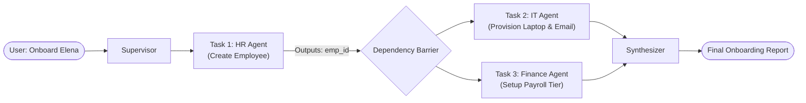
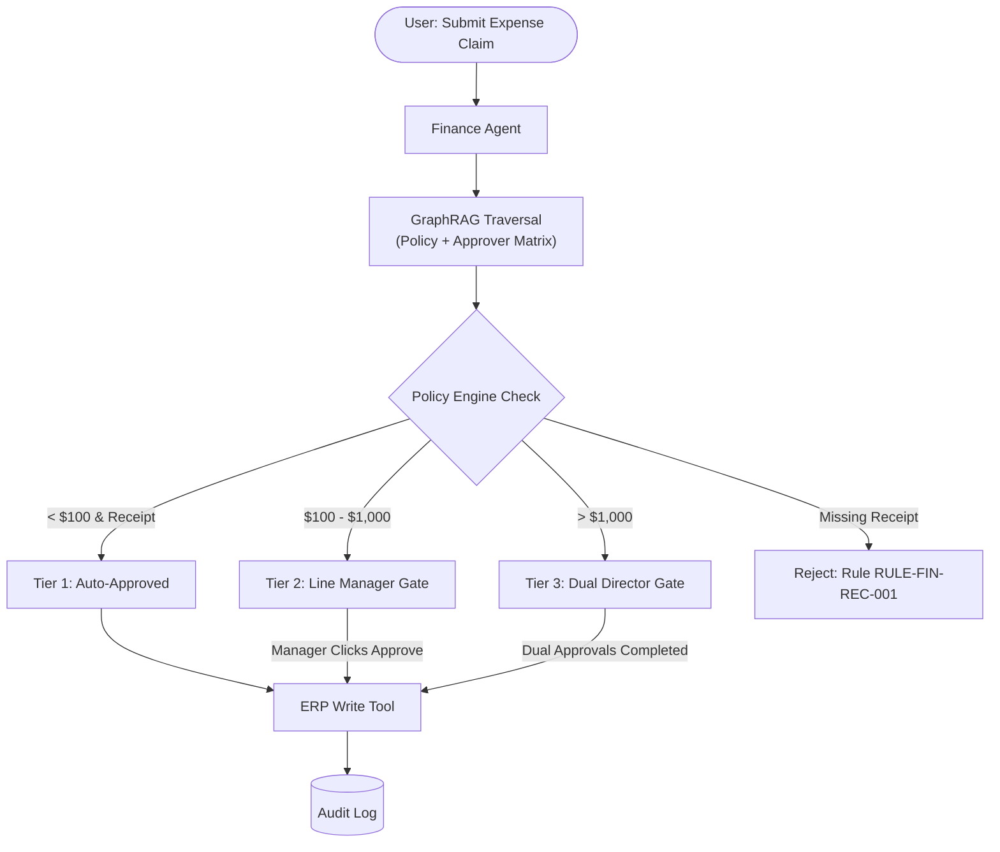
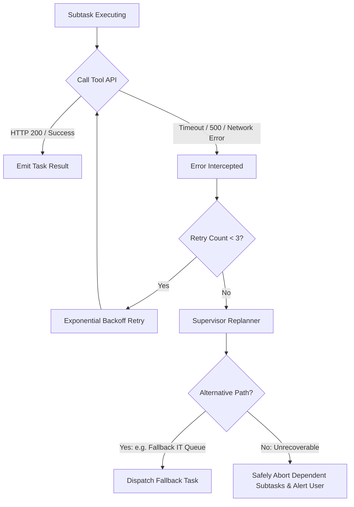

# Hierarchical Agent Coordination Architecture (Graph Specification)

This document provides the formal **Graph-based Architecture** of the Hierarchical Agent Coordination Framework. It models the entire system as a directed, governed graph of agents, shared knowledge stores, governance interceptors, and typed tool executors.

---

## 1. Complete System Architecture Graph

```mermaid
graph TD
    %% Styling Definitions
    classDef clientLayer fill:#F1F5F9,stroke:#64748B,stroke-width:2px,color:#0F172A;
    classDef supervisorLayer fill:#EFF6FF,stroke:#2563EB,stroke-width:2px,color:#1E3A8A;
    classDef agentLayer fill:#FAF5FF,stroke:#9333EA,stroke-width:2px,color:#581C87;
    classDef governanceLayer fill:#FEF2F2,stroke:#DC2626,stroke-width:2px,color:#7F1D1D;
    classDef toolLayer fill:#ECFDF5,stroke:#059669,stroke-width:2px,color:#064E3B;
    classDef storageLayer fill:#FFFBEB,stroke:#D97706,stroke-width:2px,color:#78350F;

    %% Client & Gateway
    User(["👤 Enterprise User / Web Console"]):::clientLayer
    Gateway["🛡️ API Gateway<br/>(Auth, JWT, RBAC, Rate Limiter)"]:::clientLayer
    
    User -->|1. Natural Language Request| Gateway
    Gateway -->|2. Validated Session & Role Token| Supervisor

    %% Supervisor Orchestration Subgraph
    subgraph SupervisorGraph ["Central Supervisor Orchestration (LangGraph Engine)"]
        Supervisor["🧠 Supervisor Agent<br/>(Planner & Synthesizer)"]:::supervisorLayer
        IntentClassifier["🎯 Intent Classifier"]:::supervisorLayer
        PlannerDAG["📐 Task Graph Planner<br/>(Produces JSON DAG)"]:::supervisorLayer
        Scheduler["⚡ Execution Scheduler<br/>(Parallel / Sequential Dispatch)"]:::supervisorLayer
        Replanner["🔄 Dynamic Replanner<br/>(Circuit Breaker & Fallback)"]:::supervisorLayer
        Synthesizer["📝 Final Synthesizer<br/>(Citation & Result Grounding)"]:::supervisorLayer

        Supervisor --> IntentClassifier
        IntentClassifier --> PlannerDAG
        PlannerDAG --> Scheduler
        Scheduler -.->|Tool Error / Timeout| Replanner
        Replanner -.->|Replanned Subtasks| Scheduler
        Scheduler --> Synthesizer
    end

    %% Department Specialized Agents
    subgraph DepartmentAgents ["Tier 2: Specialized Department Agents (Pydantic Contracts)"]
        HRAgent["👔 HR Agent<br/>(Onboarding & Leaves)"]:::agentLayer
        FinAgent["💰 Finance Agent<br/>(Expenses & Payroll)"]:::agentLayer
        ITAgent["💻 IT Agent<br/>(Incidents & Provisioning)"]:::agentLayer
    end

    Scheduler -->|Task: task_hr_01 (Typed JSON)| HRAgent
    Scheduler -->|Task: task_fin_01 (Typed JSON)| FinAgent
    Scheduler -->|Task: task_it_01 (Typed JSON)| ITAgent

    %% Shared Intelligence & Retrieval Layer
    subgraph IntelligenceStore ["Shared Knowledge & RAG Layer"]
        HybridRetriever["🔍 Hybrid Retriever<br/>(TF-IDF + Dense Vector)"]:::storageLayer
        GraphRAGStore["🕸️ Enterprise GraphDB / Knowledge Graph<br/>(Policy Entities, Roles, Approval Chains)"]:::storageLayer
        PolicyCorpus[("📄 Synthetic Policies<br/>(POL-HR, POL-FIN, POL-IT)")]:::storageLayer

        PolicyCorpus --> HybridRetriever
        PolicyCorpus --> GraphRAGStore
    end

    HRAgent <-->|Role-Filtered Query| HybridRetriever
    FinAgent <-->|Role-Filtered Query| HybridRetriever
    ITAgent <-->|Role-Filtered Query| HybridRetriever

    HRAgent <-->|Multi-Hop Approval Traversal| GraphRAGStore
    FinAgent <-->|Multi-Hop Approval Traversal| GraphRAGStore
    ITAgent <-->|Multi-Hop Approval Traversal| GraphRAGStore

    %% Governance & Safety Interceptors
    subgraph GovernanceLayer ["Tier 3: Governance & Safety Interceptors"]
        PolicyEngine{"⚖️ Policy Engine<br/>(Rules, Tiers, Receipts)"}:::governanceLayer
        ApprovalGate["🛑 Human Approval Gate<br/>(HITL Interruption for Tier 3 Risk)"]:::governanceLayer
        AuditLogStore[("📜 Immutable Audit Log<br/>(PostgreSQL / SQLite)")]:::governanceLayer
    end

    HRAgent -->|Proposed Write Action| PolicyEngine
    FinAgent -->|Proposed Write Action| PolicyEngine
    ITAgent -->|Proposed Write Action| PolicyEngine

    PolicyEngine -->|Low / Medium Risk (Auto)| ToolLayer
    PolicyEngine -->|High Risk (> $1000 / External Send)| ApprovalGate
    ApprovalGate -->|Human Manager Authorizes| ToolLayer
    ApprovalGate -.->|Human Rejection| Scheduler

    PolicyEngine -->|Log Decision & State| AuditLogStore

    %% Typed Tool Layer & Mock Systems
    subgraph ToolLayer ["Tier 4: Typed Tool Layer & Enterprise Backends"]
        HRMSTools["HRMS Toolset<br/>(hrms_create_employee)"]:::toolLayer
        ERPTools["ERP Toolset<br/>(erp_submit_expense, erp_setup_payroll)"]:::toolLayer
        TicketTools["Ticketing & Alerts<br/>(ticketing_create_ticket, email_send)"]:::toolLayer

        HRMS_API[("🏢 Mock HRMS Service")]:::storageLayer
        ERP_API[("📊 Mock ERP Finance Service")]:::storageLayer
        Ticket_API[("🎫 Mock IT Service")]:::storageLayer

        HRMSTools --> HRMS_API
        ERPTools --> ERP_API
        TicketTools --> Ticket_API
    end

    %% Synthesis Loop
    HRAgent -.->|Structured Result + Citations| Synthesizer
    FinAgent -.->|Structured Result + Citations| Synthesizer
    ITAgent -.->|Structured Result + Citations| Synthesizer

    Synthesizer -->|3. Grounded Enterprise Response| User
```

---

## 2. Graph Node & Edge Semantics

### 2.1 Graph Node Taxonomy
| Node Type | Responsibility | Communication Protocol |
| :--- | :--- | :--- |
| **Client / Gateway Node** | Ingress validation, JWT authentication, user role assignment (`employee`, `manager`, `admin`). | HTTP REST / JSON |
| **Supervisor Node** | High-level decomposition of natural language into an acyclic task graph (DAG). | LangGraph State Transitions |
| **Department Agent Nodes** | Domain specialists (**HR**, **Finance**, **IT**). Enforce domain reasoning and tool parameterization. | Pydantic v2 Models |
| **Policy Engine Node** | Deterministic pre-execution gate inspecting risk tier (Tier 1 Low, Tier 2 Medium, Tier 3 High). | Pure Function / Rule Matcher |
| **Human-in-the-Loop Node** | Interrupt state waiting for authorized manager / director token. | Async State Checkpoint |
| **GraphDB / RAG Nodes** | Knowledge graph of policies, rules, and employee reporting lines + dense retrieval chunks. | Vector Cosine & Cypher/Graph Traversal |
| **Typed Tool Nodes** | Atomic, allow-listed wrappers mutating mock enterprise systems. | Strongly-typed schemas |

---

### 2.2 Graph Edge (Relationship) Types
1. **`DELEGATES_SUBTASK`**: From Supervisor to Department Agent. Carries structured payload:
   ```json
   {
     "task_id": "task_fin_01",
     "agent": "finance",
     "dependencies": ["task_hr_01"],
     "risk_level": "medium",
     "inputs": {"amount": 350.0}
   }
   ```
2. **`QUERIES_KNOWLEDGE`**: From Agent to RAG/GraphDB. Passes user role and department filters; receives chunks with citations: `[POL-FIN-002:Section1]`.
3. **`EVALUATES_WRITE`**: From Agent to Policy Engine. Emits `allowed: bool`, `requires_human_approval: bool`, `rule_id`.
4. **`INTERRUPTS_FOR_HUMAN`**: Transitions workflow into state `AWAITING_APPROVAL` with designated approver (`Line_Manager` or `Director_and_Controller`).
5. **`EXECUTES_TOOL`**: Dispatches allowed write actions to mock systems.
6. **`LOGS_AUDIT`**: Appends immutable audit entry to PostgreSQL/SQLite table with timestamp, actor, system, and payload.
7. **`SYNTHESIZES_RESULT`**: Aggregates verified outputs into final cited response.

---

## 3. Flagship Workflow Subgraphs

### 3.1 Workflow 1: Employee Onboarding Execution Graph


### 3.2 Workflow 2: Expense Approval with Graph Governance


---

## 4. Failure Recovery & Dynamic Replanning Graph


